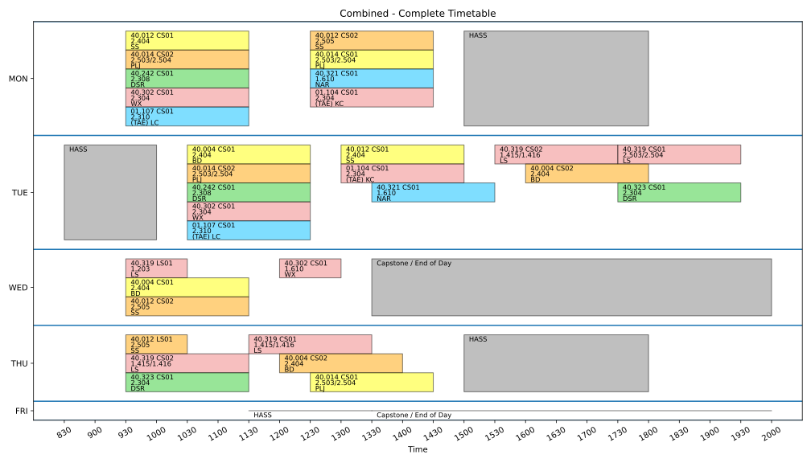

This contains the visualisation module for SUTD [40.302](https://esd.sutd.edu.sg/courses/40302-advanced-topics-in-optimisation/) Advanced Topics in Optimisation.

We were given 2020's timetable and were tasked to optimise the timetable along certain metrics that we define.

Timetable given for optimisation

Timetable produced after optimisation
 

Other views of the timetable are available on this [link](https://tonghuikang.github.io/adv-opti-project/viz-task-3). We show the classes that are relevant to each focus track student, each course, and each instructor.

This takes in output provided by the Gurobi solver and produce views of the timetable plotted by Matplotlib. The mathematical formulation and the solver code is not available here (and not done by me), and will not be included here to allow future projects to explore design directions from scratch.

Briefly, these are relevant contents in this repository that you can use

- viz.ipynb contains code to 
  - parse the original timetable
  - organise the sessions into different rows to be plotted (which is another scheduling problem in itself)
  - plot the various views of the timetable
  - save the code as a python script viz.py which allow modules to be imported by other notebooks
- generate-doc.ipynb contains code to produce a markdown file containing the views of the timetable, so that I can save time writing the highly repeated markdown script and implement changes quickly.

Feel free to use this code with attribution for the future projects - if you can figure out how it works :)

