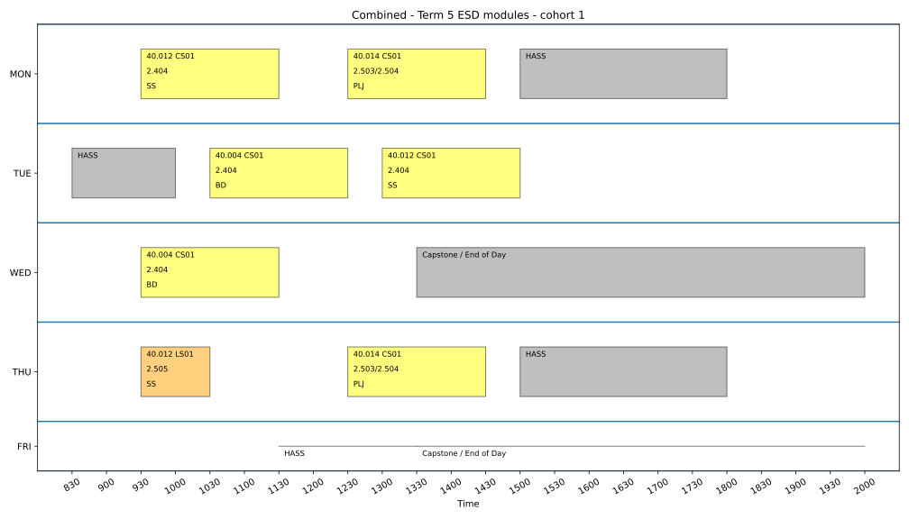
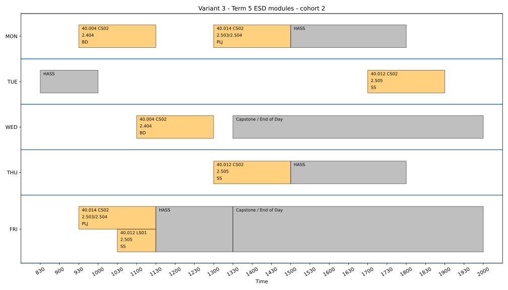
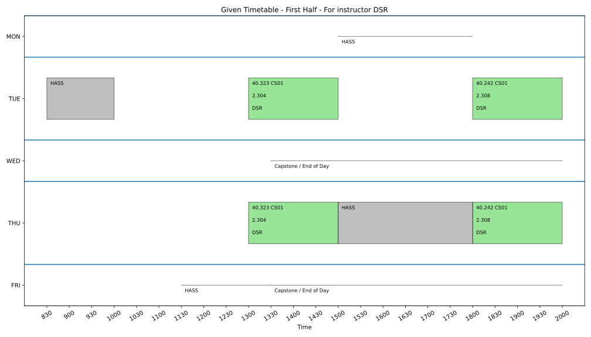
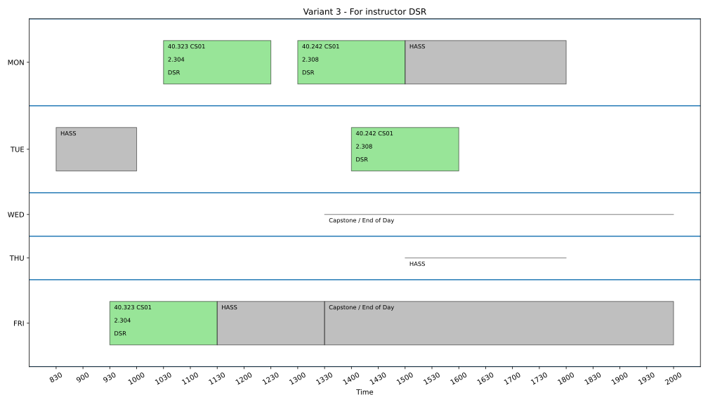
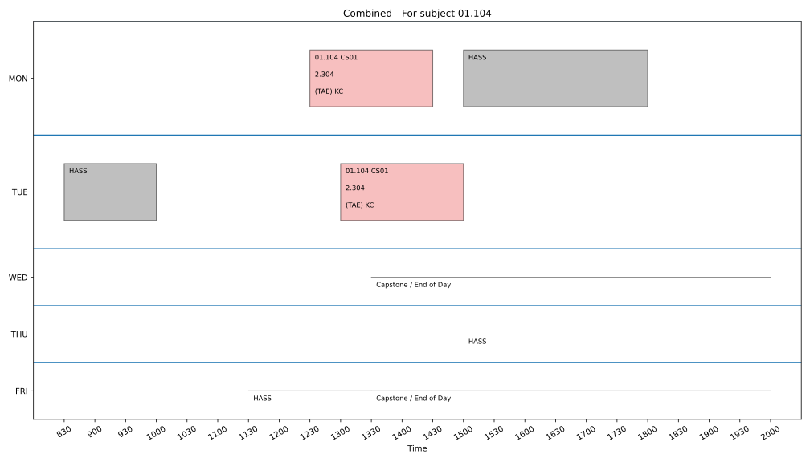
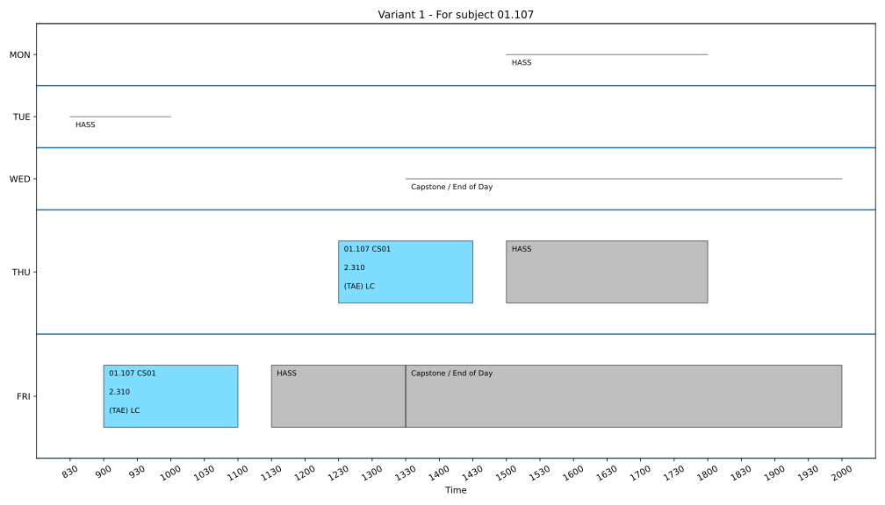
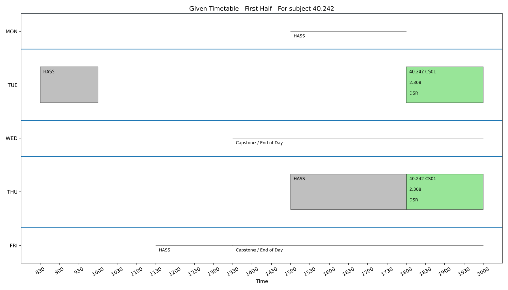
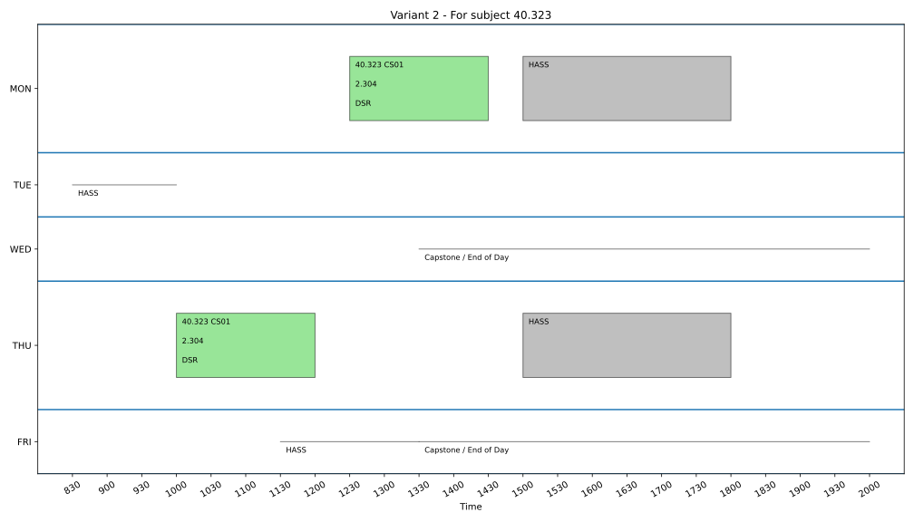

This appendix contains the timetable visualisation for Team Kutosotase.

This presents the **first half** of Term 5/7.
Please refer to this [page](./viz-task-3-second-half.md) for the second half Term 5/7.

In each page (this webpage is print-friendly), there are five timetables arranged in a table.
  - The original timetable
  - The timetable with variant 1 - back-to-back classes
  - The timetable with variant 2 - number of days in school for a focus track cohort
  - The timetable with variant 3 - number of undesirable class times
  - The timetable combining the variants

We present different views of the timetable for the first half of term 5/7.
  - ESD Term 5 and ESD Term 7 courses
  - Courses taken by each ESD Term 5 modules
  - ESD Term 7 courses, with core modules highlighted for each track
  - Each course involved in the optimisation
  - Each instructor involved in the optimisation

The color represents a track or a term 5 cohort

| Color | Group | Comments |
| ----- | ----- | -------- |
| yellow | T5 Cohort 1  |  |
| orange | T5 Cohort 2  |  |
| green  | Finance      |  |
| blue   | Aviation     | also Urban Infrastructure |
| red    | BA/OR        | also Supply Chain         |

As the requirements for Supply Chain track is a subset of BA/OR track, and the requirements for Urban Infrastructure track is a subset of the Aviation track, we do not assign a color for Supply Chain and Urban Infrastructure track.

Table of contents

* auto-gen TOC:
{:toc}

## Combined timetable

| <!-- -->    | <!-- -->    |
| ----------------------------------- | ------------ |
| Timetable given for optimisation  | Variant 1  |
| Combined objectives                          | Variant 2  |
|                                                                              | Variant 3  |

## Complete Term 5 timetable

| <!-- -->    | <!-- -->    |
| ----------------------------------- | ------------ |
| Timetable given for optimisation  | Variant 1  |
| Combined objectives                          | Variant 2  |
|                                                                              | Variant 3  |

## Complete Term 7 timetable

| <!-- -->    | <!-- -->    |
| ----------------------------------- | ------------ |
| Timetable given for optimisation  | Variant 1  |
| Combined objectives                          | Variant 2  |
|                                                                              | Variant 3  |

## Term 5 timetable by cohort

#### Term 5 Cohort 1

| <!-- -->    | <!-- -->    |
| ----------------------------------- | ------------ |
| Timetable given for optimisation  | Variant 1  |
| Combined objectives                          | Variant 2  |
|                                                                              | Variant 3  |

#### Term 5 Cohort 2

| <!-- -->    | <!-- -->    |
| ----------------------------------- | ------------ |
| Timetable given for optimisation  | Variant 1  |
| Combined objectives                          | Variant 2  |
|                                                                              | Variant 3  |

## Term 7 timetable by track

#### Aviation Track

| <!-- -->    | <!-- -->    |
| ----------------------------------- | ------------ |
| Timetable given for optimisation  | Variant 1  |
| Combined objectives                          | Variant 2  |
|                                                                              | Variant 3  |

#### Business Analytics / Operations Research Track

| <!-- -->    | <!-- -->    |
| ----------------------------------- | ------------ |
| Timetable given for optimisation  | Variant 1  |
| Combined objectives                          | Variant 2  |
|                                                                              | Variant 3  |

#### Finance Track

| <!-- -->    | <!-- -->    |
| ----------------------------------- | ------------ |
| Timetable given for optimisation  | Variant 1  |
| Combined objectives                          | Variant 2  |
|                                                                              | Variant 3  |

#### Supply Chain and Logistics Track

| <!-- -->    | <!-- -->    |
| ----------------------------------- | ------------ |
| Timetable given for optimisation  | Variant 1  |
| Combined objectives                          | Variant 2  |
|                                                                              | Variant 3  |

#### Urban Infrastructure Track

| <!-- -->    | <!-- -->    |
| ----------------------------------- | ------------ |
| Timetable given for optimisation  | Variant 1  |
| Combined objectives                          | Variant 2  |
|                                                                              | Variant 3  |

## Timetable by instructor

#### Konstantinos Courcoubetis

| <!-- -->    | <!-- -->    |
| ----------------------------------- | ------------ |
| Timetable given for optimisation  | Variant 1  |
| Combined objectives                          | Variant 2  |
|                                                                              | Variant 3  |

#### Lynette Cheah

| <!-- -->    | <!-- -->    |
| ----------------------------------- | ------------ |
| Timetable given for optimisation  | Variant 1  |
| Combined objectives                          | Variant 2  |
|                                                                              | Variant 3  |

#### Bikramjit Das

| <!-- -->    | <!-- -->    |
| ----------------------------------- | ------------ |
| Timetable given for optimisation  | Variant 1  |
| Combined objectives                          | Variant 2  |
|                                                                              | Variant 3  |

#### Douglas Streeter Rolph

| <!-- -->    | <!-- -->    |
| ----------------------------------- | ------------ |
| Timetable given for optimisation  | Variant 1  |
| Combined objectives                          | Variant 2  |
|                                                                              | Variant 3  |

#### Lin Shaowei

| <!-- -->    | <!-- -->    |
| ----------------------------------- | ------------ |
| Timetable given for optimisation  | Variant 1  |
| Combined objectives                          | Variant 2  |
|                                                                              | Variant 3  |

#### Nuno Antunes Ribeiro

| <!-- -->    | <!-- -->    |
| ----------------------------------- | ------------ |
| Timetable given for optimisation  | Variant 1  |
| Combined objectives                          | Variant 2  |
|                                                                              | Variant 3  |

#### Peter Lawrence Jackson

| <!-- -->    | <!-- -->    |
| ----------------------------------- | ------------ |
| Timetable given for optimisation  | Variant 1  |
| Combined objectives                          | Variant 2  |
|                                                                              | Variant 3  |

#### Shrutivandana Sharma

| <!-- -->    | <!-- -->    |
| ----------------------------------- | ------------ |
| Timetable given for optimisation  | Variant 1  |
| Combined objectives                          | Variant 2  |
|                                                                              | Variant 3  |

#### Wang Xingyin

| <!-- -->    | <!-- -->    |
| ----------------------------------- | ------------ |
| Timetable given for optimisation  | Variant 1  |
| Combined objectives                          | Variant 2  |
|                                                                              | Variant 3  |

## Timetable by subject

#### 01.104 Networked Life

| <!-- -->    | <!-- -->    |
| ----------------------------------- | ------------ |
| Timetable given for optimisation  | Variant 1  |
| Combined objectives                          | Variant 2  |
|                                                                              | Variant 3  |

#### 01.107 Urban Transportation

| <!-- -->    | <!-- -->    |
| ----------------------------------- | ------------ |
| Timetable given for optimisation  | Variant 1  |
| Combined objectives                          | Variant 2  |
|                                                                              | Variant 3  |

#### 40.004 Statistics

| <!-- -->    | <!-- -->    |
| ----------------------------------- | ------------ |
| Timetable given for optimisation  | Variant 1  |
| Combined objectives                          | Variant 2  |
|                                                                              | Variant 3  |

#### 40.012 Manufacturing and Service Operations

| <!-- -->    | <!-- -->    |
| ----------------------------------- | ------------ |
| Timetable given for optimisation  | Variant 1  |
| Combined objectives                          | Variant 2  |
|                                                                              | Variant 3  |

#### 40.014 Engineering Systems Architecture

| <!-- -->    | <!-- -->    |
| ----------------------------------- | ------------ |
| Timetable given for optimisation  | Variant 1  |
| Combined objectives                          | Variant 2  |
|                                                                              | Variant 3  |

#### 40.242 Derivative Pricing and Risk Management

| <!-- -->    | <!-- -->    |
| ----------------------------------- | ------------ |
| Timetable given for optimisation  | Variant 1  |
| Combined objectives                          | Variant 2  |
|                                                                              | Variant 3  |

#### 40.302 Advanced Topics in Optimisation

| <!-- -->    | <!-- -->    |
| ----------------------------------- | ------------ |
| Timetable given for optimisation  | Variant 1  |
| Combined objectives                          | Variant 2  |
|                                                                              | Variant 3  |

#### 40.319 Statistical and Machine Learning

| <!-- -->    | <!-- -->    |
| ----------------------------------- | ------------ |
| Timetable given for optimisation  | Variant 1  |
| Combined objectives                          | Variant 2  |
|                                                                              | Variant 3  |

#### 40.321 Airport Systems Modelling and Simulation

| <!-- -->    | <!-- -->    |
| ----------------------------------- | ------------ |
| Timetable given for optimisation  | Variant 1  |
| Combined objectives                          | Variant 2  |
|                                                                              | Variant 3  |

#### 40.323 Equity Valuation

| <!-- -->    | <!-- -->    |
| ----------------------------------- | ------------ |
| Timetable given for optimisation  | Variant 1  |
| Combined objectives                          | Variant 2  |
|                                                                              | Variant 3  |

