Table of contents

* auto-gen TOC:
{:toc}

# First half

## Complete timetable

## Complete Term 5 timetable

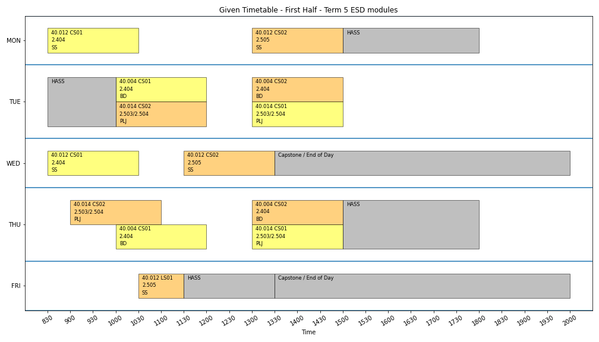
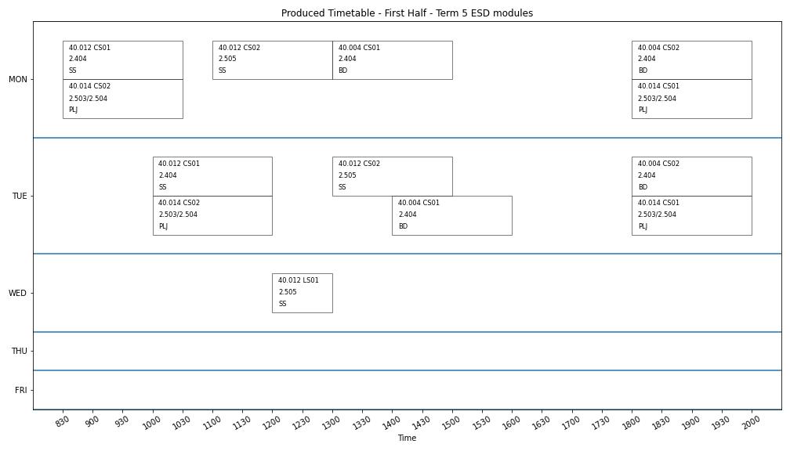

## Complete Term 7 timetable

## Term 5 timetable by cohort

## Term 7 timetable by track

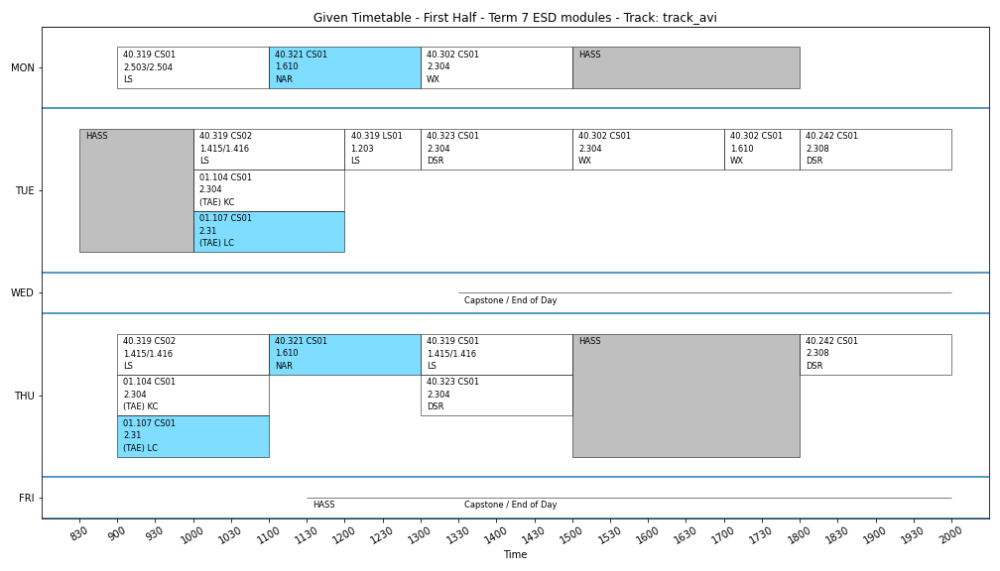

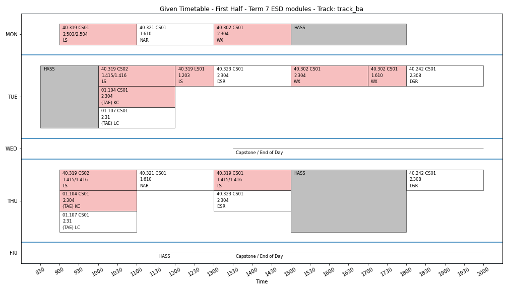
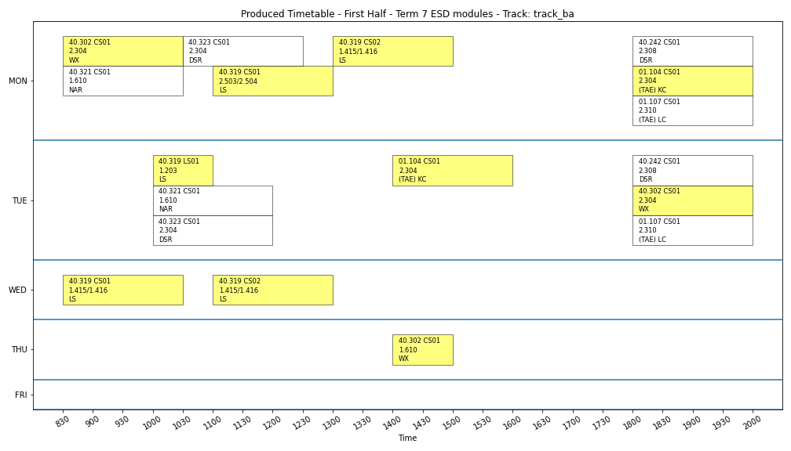

## Timetable by instructor

 KC.png)
 KC.png)

 LC.png)
 LC.png)

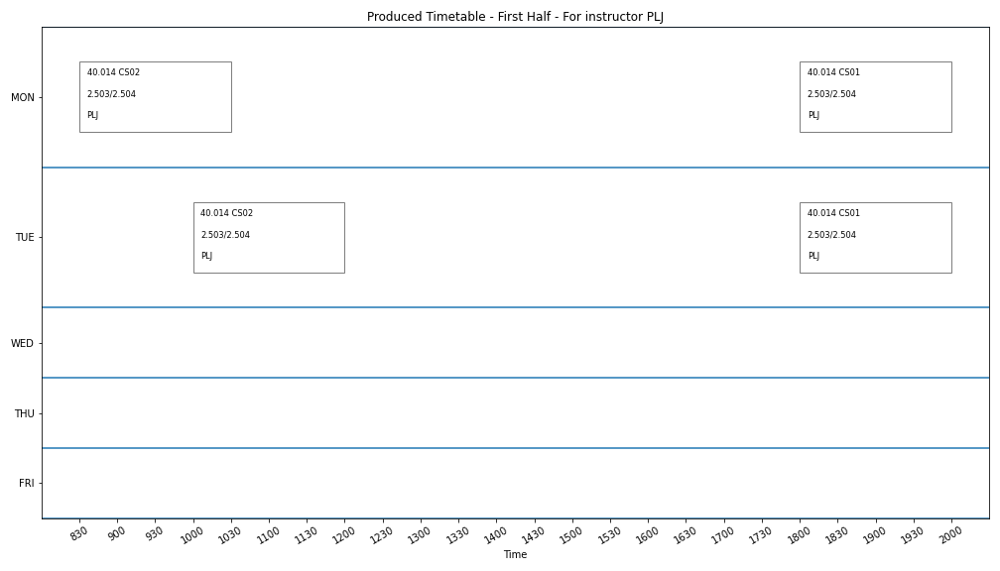

## Timetable by subject

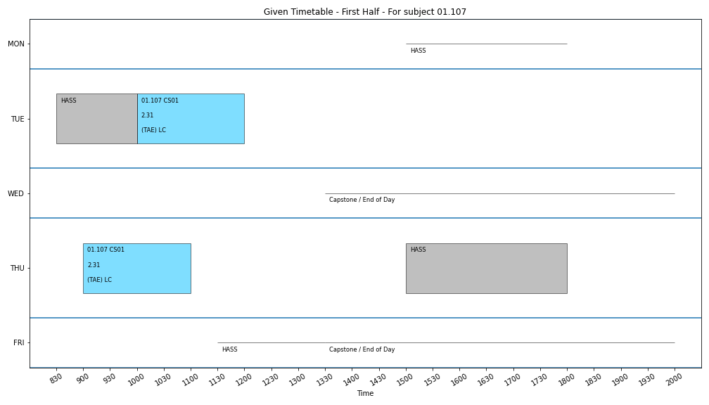

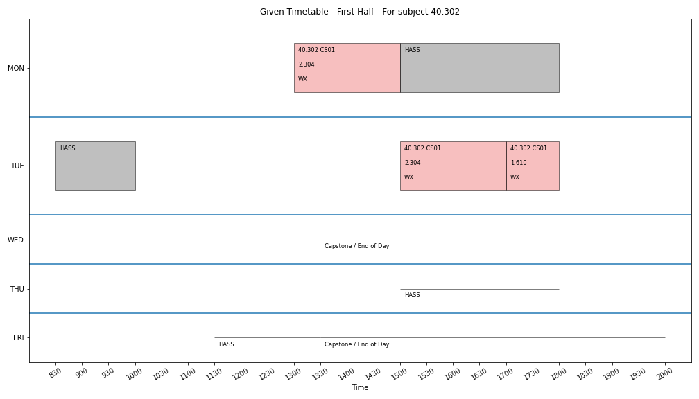

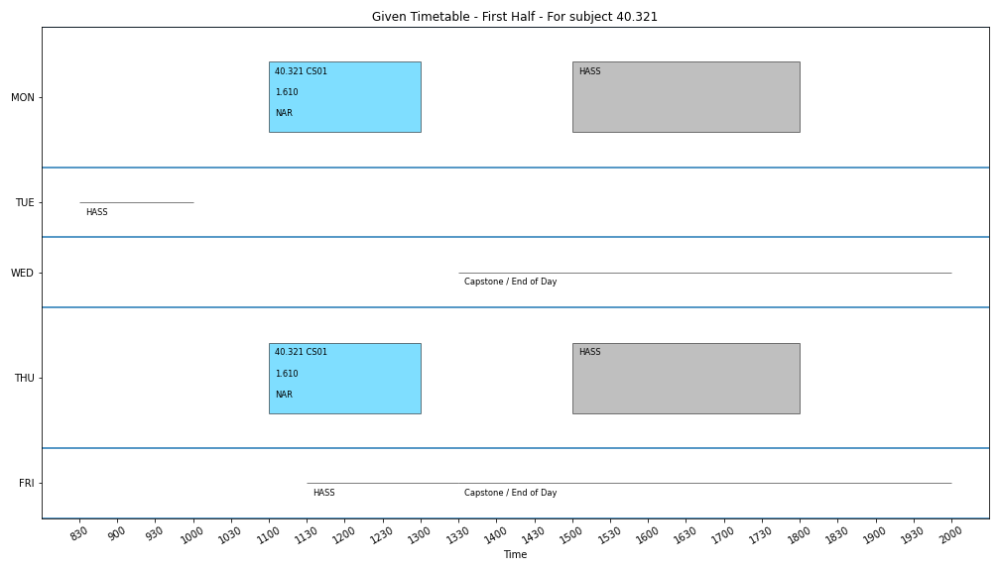

# Second half

## Complete timetable

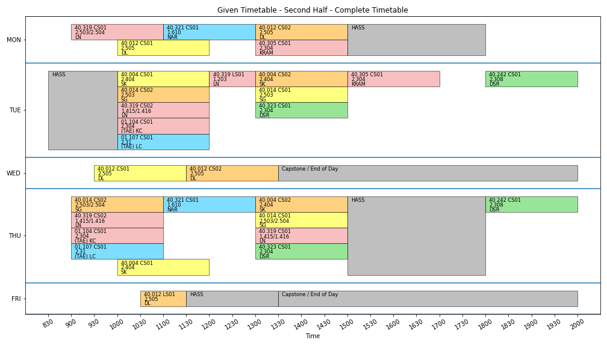

## Complete Term 5 timetable

## Complete Term 7 timetable

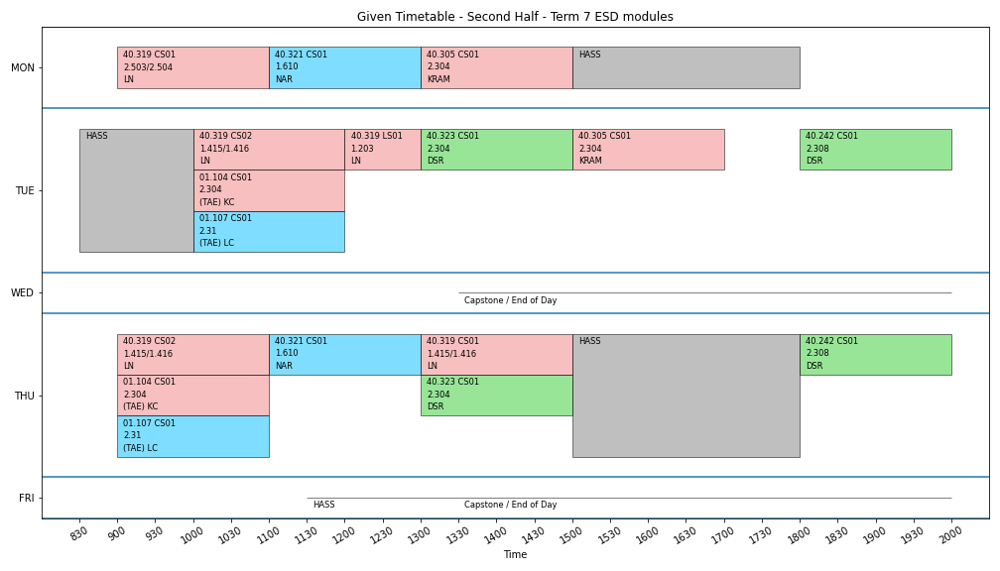

## Term 5 timetable by cohort

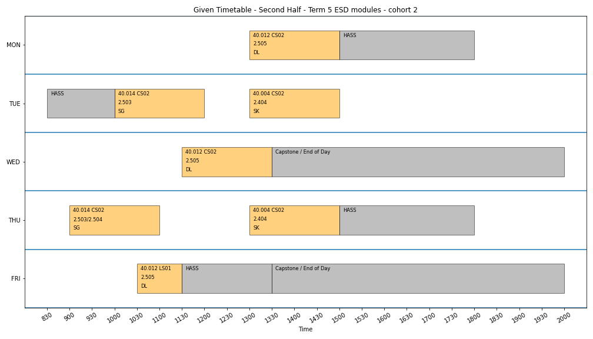

## Term 7 timetable by track

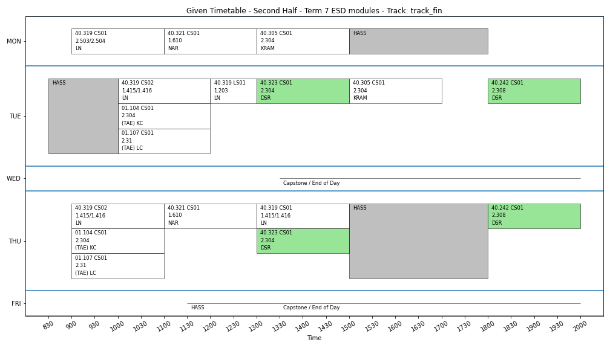

## Timetable by instructor

 KC.png)
 KC.png)

 LC.png)
 LC.png)

## Timetable by subject

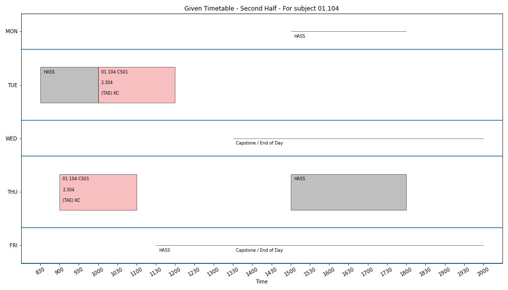

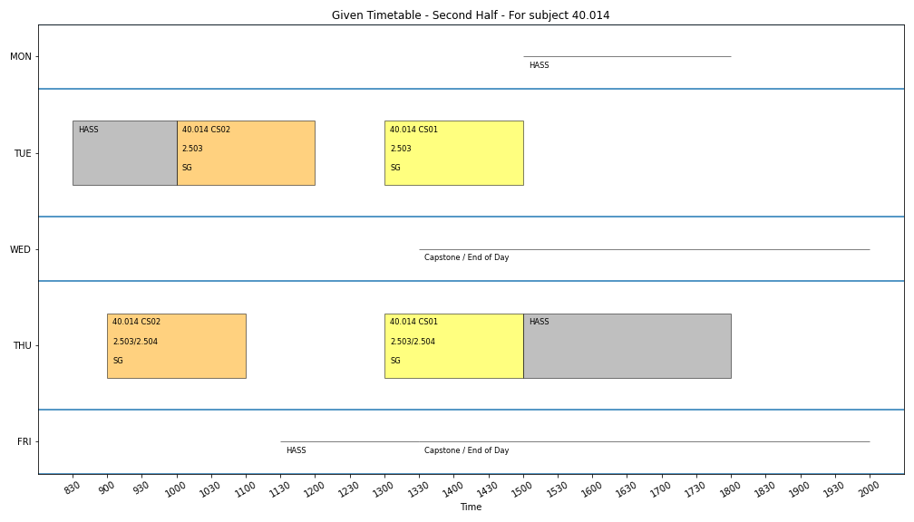

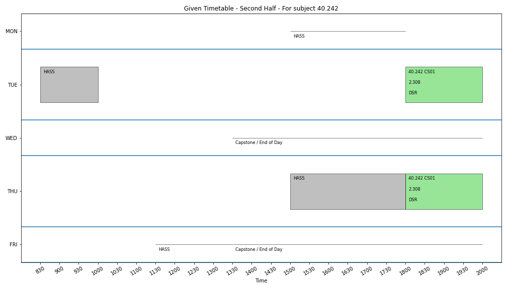

