This appendix contains the timetable visualisation.

- In each page (this webpage is print-friendly), there are two timetables. The timetable on top is the timetable given to us for optimisation, and the timetable below is produced after optimisation.
- We produced a different set of timetables for the first half and the second half of 2020 Spring Term.
- For each half, we present different views of the timetable.
  - ESD Term 5 and ESD Term 7 courses
  - Courses taken by each ESD Term 5 modules
  - ESD Term 7 courses, with core modules highlighted for each track
  - Each course involved in the optimisation
  - Each instructor involved in the optimisation

Table of contents

* auto-gen TOC:
{:toc}

# First half

Timetable given for optimisation

Timetable produced after optimisation

## Complete Term 5 timetable

Timetable given for optimisation

Timetable produced after optimisation

## Complete Term 7 timetable

Timetable given for optimisation

Timetable produced after optimisation

## Term 5 timetable by cohort

Timetable given for optimisation

Timetable produced after optimisation
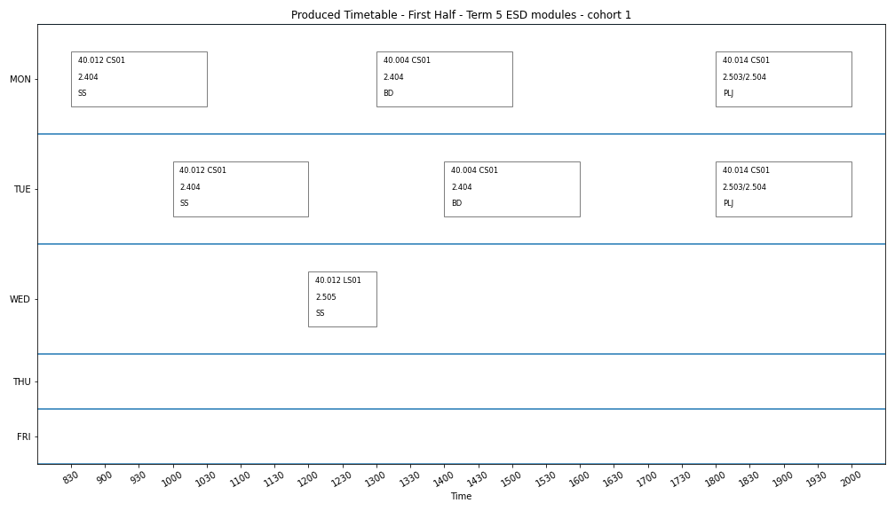

Timetable given for optimisation

Timetable produced after optimisation

## Term 7 timetable by track

Timetable given for optimisation

Timetable produced after optimisation
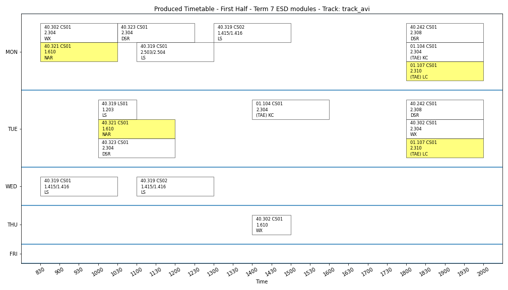

Timetable given for optimisation

Timetable produced after optimisation

Timetable given for optimisation
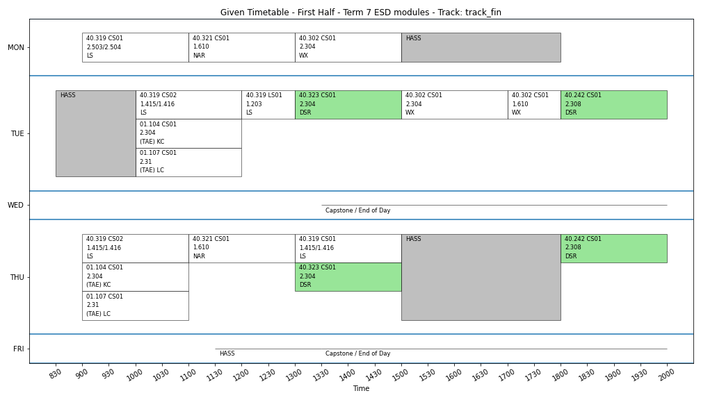

Timetable produced after optimisation

Timetable given for optimisation

Timetable produced after optimisation

Timetable given for optimisation

Timetable produced after optimisation

## Timetable by instructor

Timetable given for optimisation
 KC.png)

Timetable produced after optimisation
 KC.png)

Timetable given for optimisation
 LC.png)

Timetable produced after optimisation
 LC.png)

Timetable given for optimisation

Timetable produced after optimisation

Timetable given for optimisation
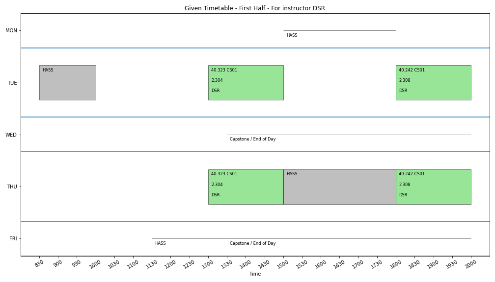

Timetable produced after optimisation

Timetable given for optimisation

Timetable produced after optimisation

Timetable given for optimisation

Timetable produced after optimisation

Timetable given for optimisation

Timetable produced after optimisation

Timetable given for optimisation
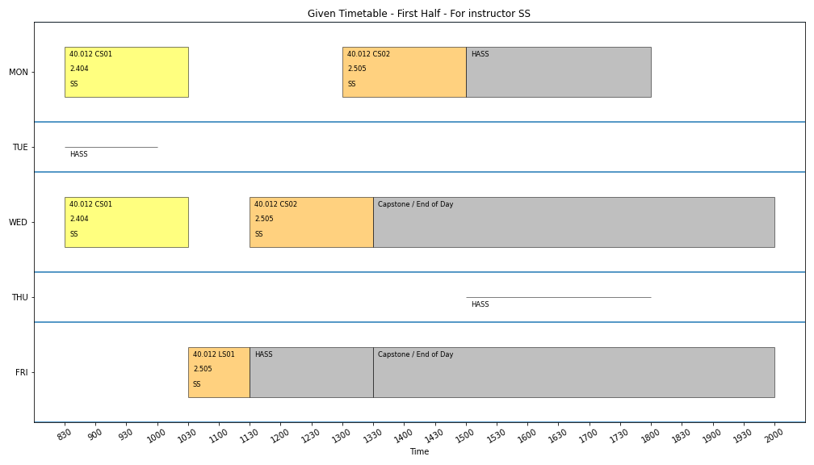

Timetable produced after optimisation

Timetable given for optimisation

Timetable produced after optimisation

## Timetable by subject

Timetable given for optimisation

Timetable produced after optimisation

Timetable given for optimisation

Timetable produced after optimisation

Timetable given for optimisation

Timetable produced after optimisation

Timetable given for optimisation

Timetable produced after optimisation

Timetable given for optimisation

Timetable produced after optimisation

Timetable given for optimisation

Timetable produced after optimisation

Timetable given for optimisation

Timetable produced after optimisation

Timetable given for optimisation

Timetable produced after optimisation

Timetable given for optimisation

Timetable produced after optimisation

Timetable given for optimisation

Timetable produced after optimisation

# Second half

Timetable given for optimisation

Timetable produced after optimisation

## Complete Term 5 timetable

Timetable given for optimisation
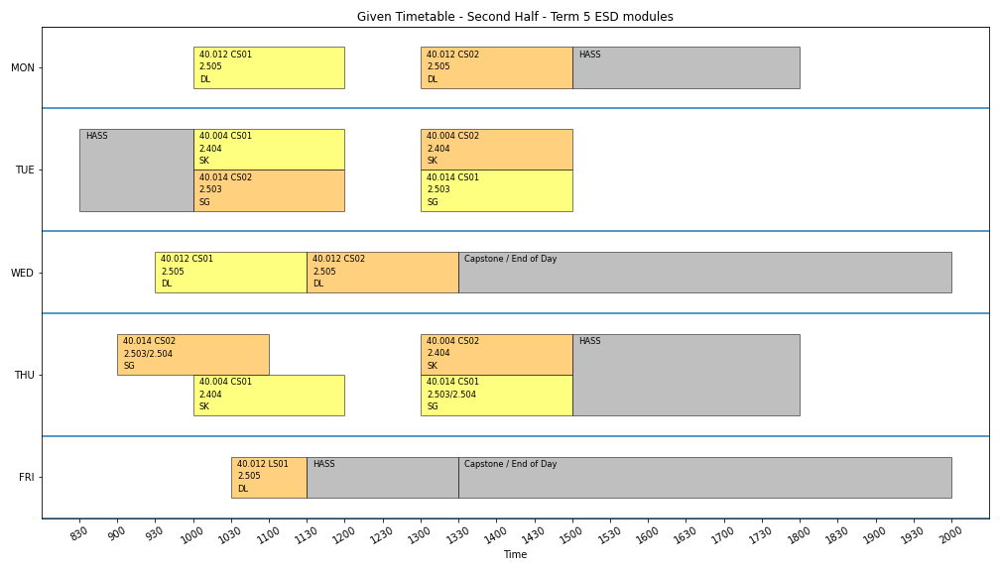

Timetable produced after optimisation

## Complete Term 7 timetable

Timetable given for optimisation

Timetable produced after optimisation

## Term 5 timetable by cohort

Timetable given for optimisation
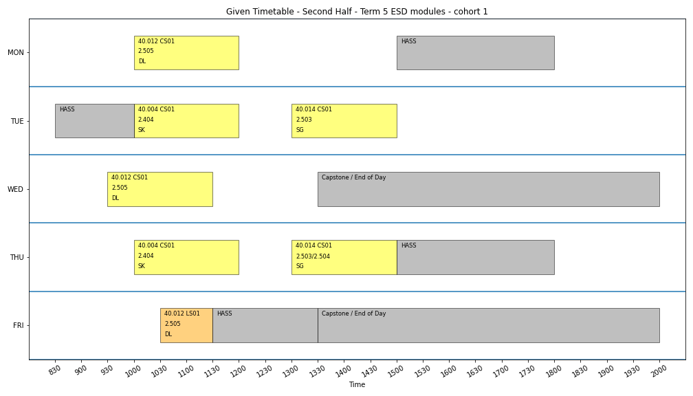

Timetable produced after optimisation

Timetable given for optimisation

Timetable produced after optimisation

## Term 7 timetable by track

Timetable given for optimisation

Timetable produced after optimisation

Timetable given for optimisation

Timetable produced after optimisation

Timetable given for optimisation

Timetable produced after optimisation

Timetable given for optimisation
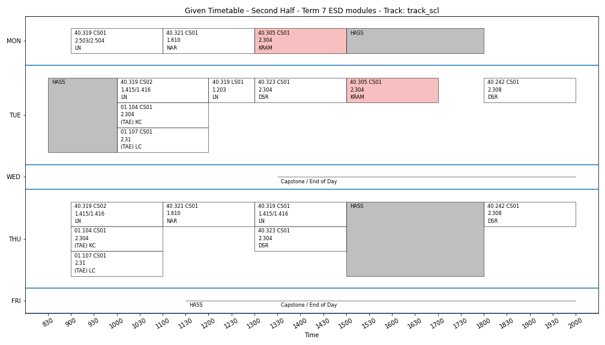

Timetable produced after optimisation

Timetable given for optimisation

Timetable produced after optimisation

## Timetable by instructor

Timetable given for optimisation
 KC.png)

Timetable produced after optimisation
 KC.png)

Timetable given for optimisation
 LC.png)

Timetable produced after optimisation
 LC.png)

Timetable given for optimisation
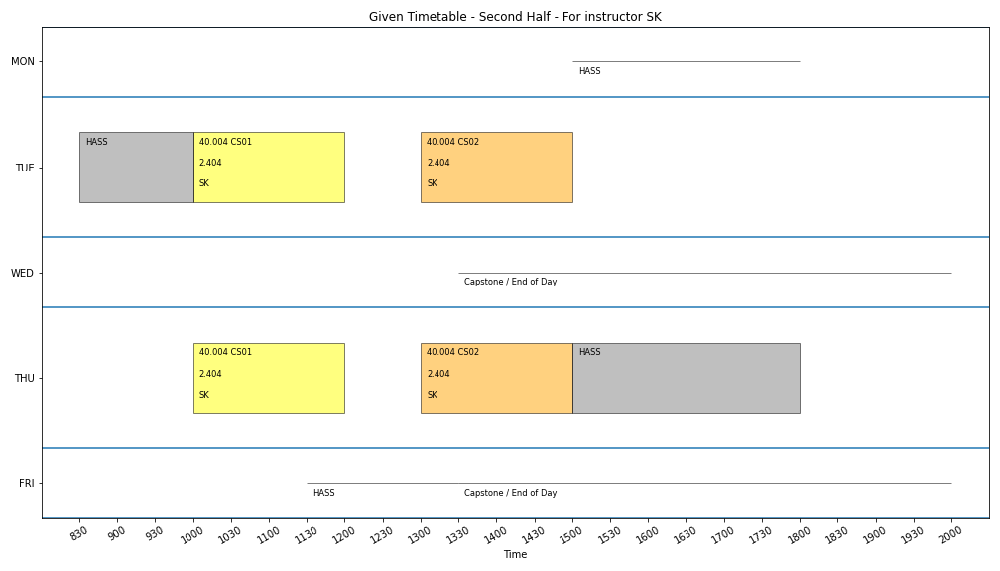

Timetable produced after optimisation
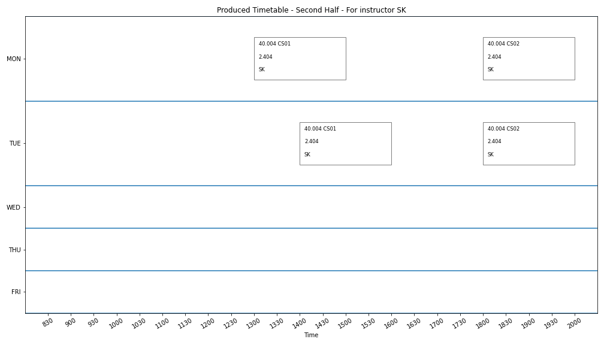

Timetable given for optimisation

Timetable produced after optimisation

Timetable given for optimisation
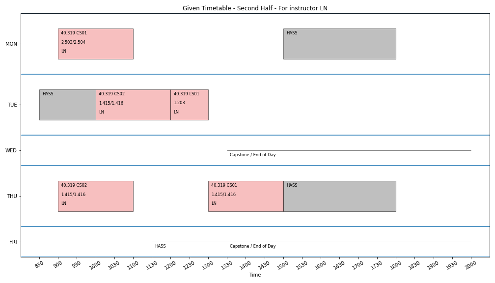

Timetable produced after optimisation

Timetable given for optimisation

Timetable produced after optimisation

Timetable given for optimisation

Timetable produced after optimisation

Timetable given for optimisation

Timetable produced after optimisation

Timetable given for optimisation

Timetable produced after optimisation

## Timetable by subject

Timetable given for optimisation

Timetable produced after optimisation

Timetable given for optimisation

Timetable produced after optimisation

Timetable given for optimisation
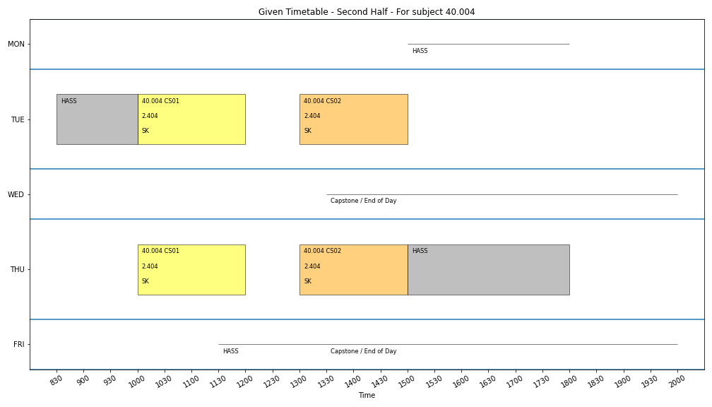

Timetable produced after optimisation

Timetable given for optimisation
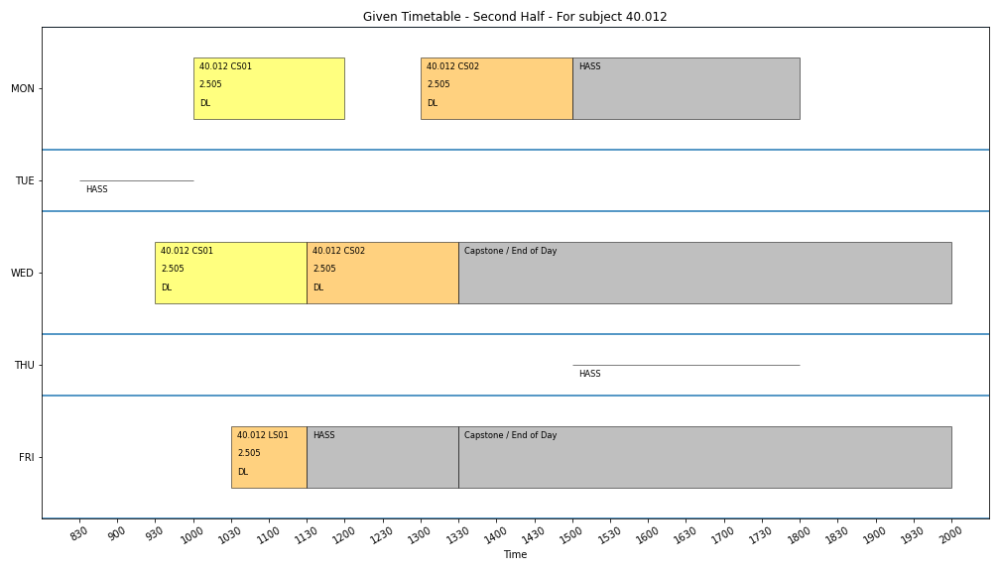

Timetable produced after optimisation

Timetable given for optimisation

Timetable produced after optimisation

Timetable given for optimisation

Timetable produced after optimisation

Timetable given for optimisation
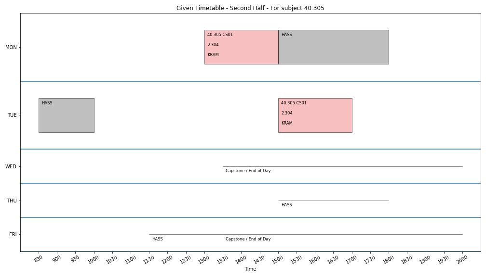

Timetable produced after optimisation

Timetable given for optimisation

Timetable produced after optimisation

Timetable given for optimisation
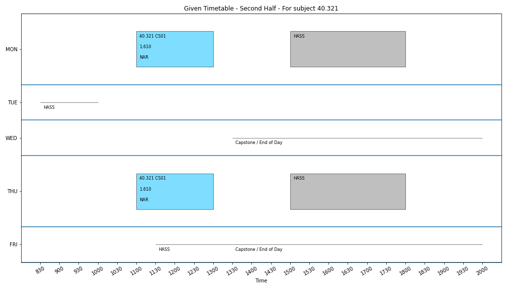

Timetable produced after optimisation

Timetable given for optimisation
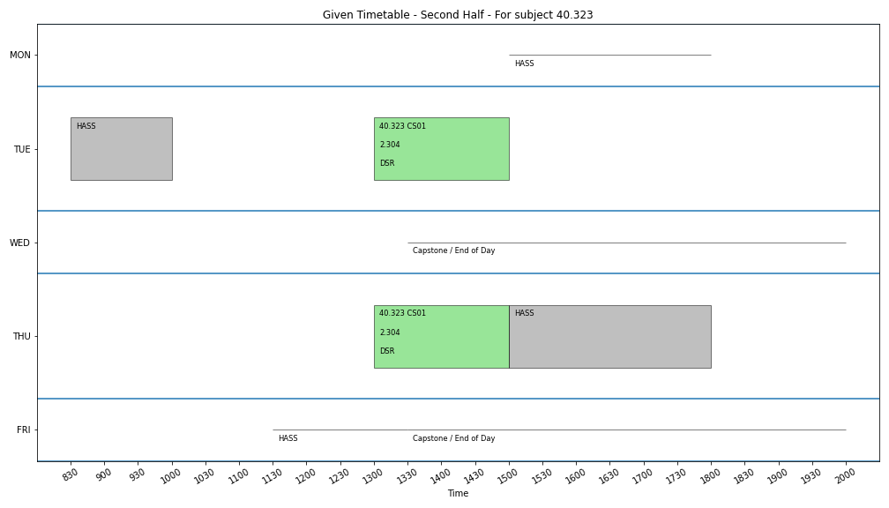

Timetable produced after optimisation

